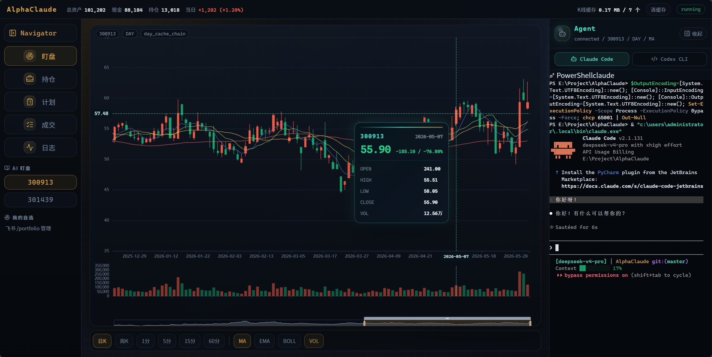

# AlphaClaude

AlphaClaude is a local AI-agent trading workstation for A-share workflows. It combines an interactive K-line dashboard, a paper-trading engine, and an embedded Claude Code / Codex terminal.



## What You Get

- **Interactive K-line dashboard**: day, week, 1m, 5m, 15m, and 60m candles with MA/EMA/BOLL, volume, crosshair tooltip, zoom, pan, and local cache controls.
- **Paper-trading engine**: pre-market Agent research writes `plan.json`; intraday Python executes mechanically; `state.json` and `ledger.jsonl` keep the run auditable.
- **Embedded Agent terminal**: the right panel is a real `xterm` PowerShell session that can launch Claude Code or Codex CLI inside the dashboard.
- **Feishu notifications**: Feishu is a notification and fallback command channel, not the primary UI. The dashboard is the main workstation.

Live trading is not enabled. The current project is for research, dashboarding, backtesting, and paper trading until broker integration, human confirmation, order idempotency, and safety gates are implemented.

## Quick Start

### Dashboard First

Use this path if you want to see the workstation before wiring every integration.

```bash
git clone https://github.com/44-99/AlphaClaude.git
cd AlphaClaude
pip install -r requirements.txt
pip install -e .
npm install
npm run dev
```

Open `http://localhost:5173`.

`npm run dev` starts the FastAPI backend on `8800`, starts Vite on `5173`, proxies `/api/*` and WebSocket traffic to the backend, and clears old dev processes occupying those ports.

### Full Setup

Requirements:

- Python 3.10+
- Node.js 20+ and npm
- Claude Code CLI
- Optional: Codex CLI
- Optional: Feishu developer account for notifications

Create `.env` from `.env.example` and fill in the integrations you need:

```bash
FEISHU_APP_ID=cli_xxxxxxxxxxxxxxxx
FEISHU_APP_SECRET=xxxxxxxxxxxxxxxxxxxxxxxxxxxxxxxx
FEISHU_BOT_NAME=StockBot
FEISHU_BOT_OPEN_ID=ou_xxxxxxxxxxxxxxxxxxxxxxxxxxxxxxxx

CLAUDE_CMD=C:\Users\YourName\AppData\Roaming\npm\claude.cmd
CLAUDE_TIMEOUT=300

ANTHROPIC_AUTH_TOKEN=sk-xxxxxxxxxxxxxxxxxxxxxxxxxxxxxxxx
ANTHROPIC_BASE_URL=https://api.example.com/anthropic
ANTHROPIC_MODEL=your-model
```

Production-style dashboard:

```bash
npm run dashboard:build
alphaclaude app start
```

Open `http://localhost:8800/dashboard`.

## Commands

Engine:

```bash
alphaclaude engine start --mode backtest --start 2024-01-01 --end 2024-06-30 -u default
alphaclaude engine start --mode paper -u default --daemon
alphaclaude engine list
alphaclaude engine status paper_2026-05-16T09-00-00
alphaclaude engine stop paper_2026-05-16T09-00-00
alphaclaude engine resume paper_2026-05-16T09-00-00 --daemon
alphaclaude engine stop-running
```

Tools:

```bash
alphaclaude tools quote 600519
alphaclaude tools technical 600519 --all
alphaclaude tools backtest 600519 -s ma_cross
alphaclaude tools backtest_runner --start 2024-01-01 --end 2024-06-30 -u default
```

Feishu command menus are documented separately in [docs/feishu-bot-menu.md](docs/feishu-bot-menu.md).

## Current Status

- Python package structure lives under `src/alphaclaude/`.
- Dashboard source lives under `dashboard/` and builds to `dashboard/dist/`.
- Backtest and paper trading share the `alphaclaude.engine` core.
- Dashboard API, SSE, K-line cache, and Agent terminal WebSocket live in `src/alphaclaude/app/dashboard.py`.
- Feishu integration lives under `src/alphaclaude/feishu/`.
- `live` mode is reserved and not admitted for real-money trading.

## Project Layout

- `src/alphaclaude/app/`: FastAPI app, Dashboard API/SSE/WebSocket, app CLI.
- `src/alphaclaude/engine/`: backtest, paper trading, reserved live engine core.
- `src/alphaclaude/tools/`: quote, technical, risk, signal, report, and related CLI tools.
- `src/alphaclaude/feishu/`: Feishu auth, bot messages, groups, users, and WebSocket adapter.
- `dashboard/`: React + Vite + TypeScript dashboard source.
- `scripts/`: Windows development scripts.
- `docs/`: architecture, roadmap, Feishu menu, and project notes.

## Verification

```powershell
npm run dashboard:test
npm run dashboard:build
python -m pytest -q
python -m compileall -q src\alphaclaude
```

## Documentation

- [Architecture](docs/architecture.md)
- [Roadmap](docs/roadmap.md)
- [Skills](docs/skills.md)
- [Project comparison](docs/project-comparison.md)
- [Feishu bot menu](docs/feishu-bot-menu.md)

## License

MIT © AlphaClaude
