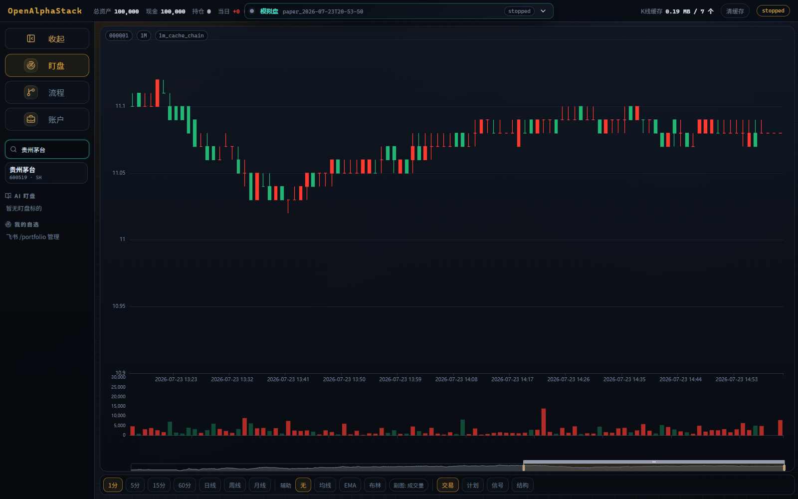
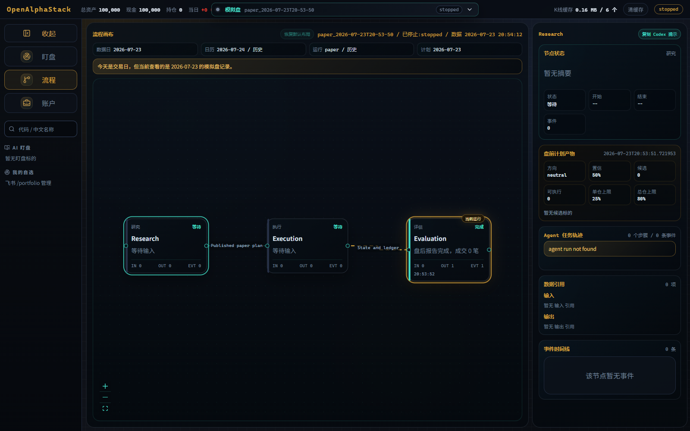

<div align="center">

<h1>OpenAlphaStack</h1>

<p>
  <a href="README.md">简体中文</a> ·
  <a href="README_EN.md">English</a>
</p>

<p><strong>面向 A 股研究、回测与模拟交易的开源 Codex 插件栈。</strong></p>

[](https://github.com/44-99/OpenAlphaStack/actions/workflows/ci.yml)
[](LICENSE)
[](pyproject.toml)
[](.codex-plugin/plugin.json)
[](.mcp.json)
[](https://github.com/44-99/OpenAlphaStack/stargazers)

[官网](https://44-99.github.io/OpenAlphaStack/) · [快速开始](#快速开始) · [架构](docs/architecture.md) · [Skills](docs/skills.md) · [路线图](docs/roadmap.md)

</div>

<p align="center">
  <a href="https://44-99.github.io/OpenAlphaStack/">
    
  </a>
</p>

OpenAlphaStack 将 A 股领域 Skills 与本地 MCP 服务打包为一个可安装的
Codex 插件。Codex Desktop 负责对话、研究和定时任务；MCP 提供有类型边界的
行情、风险、回测与模拟计划工具；Python 负责确定性校验和机械执行，不会自行
启动 Agent，也不会在缺少计划时“猜测”交易动作。

默认工作流刻意保持单 Agent：一个 Codex 任务按需组合市场分析、选股和个股
分析 Skills，不因为存在三项分析能力就默认启动三个模型工作者。

> 仅用于研究、回测与模拟交易。OpenAlphaStack 不连接真实券商下单，也不承诺任何投资收益。

## 实机演示

<p align="center">
  
</p>

<table>
  <tr>
    <td width="50%"></td>
    <td width="50%"></td>
  </tr>
  <tr>
    <td align="center"><strong>股票搜索与行情工作台</strong><br>支持代码、中文名称中的连续字符与拼音首字母。</td>
    <td align="center"><strong>三阶段可观测工作流</strong><br>研究、确定性执行与评估各自保持清晰边界。</td>
  </tr>
</table>

上图来自本地模拟盘实机，不代表投资收益。Dashboard 默认仅监听
`127.0.0.1`；[静态官网](https://44-99.github.io/OpenAlphaStack/) 只展示产品与文档，
不会公开本地账户、行情服务或执行接口。

## 为什么是 OpenAlphaStack？

- **一个插件，两层扩展能力**：用 Codex Skills 承载可复用研究方法，用 MCP
  暴露有类型、有边界的本地工具。
- **Agent 研究，确定性执行**：Codex 分析并提出计划；Python 负责 T+1、费用、
  状态迁移、硬约束和模拟成交。
- **可审计**：显式计划、版本检查、幂等键、追加式账本和可观测工作流事件。
- **本地优先**：行情工具、账户状态和执行记录保留在本地，而不是隐藏在 Agent
  子进程中。
- **诚实的安全边界**：所有可变更工具仅作用于模拟盘，不提供真实下单 MCP 工具。

## 架构

```text
Codex 任务或定时提示词
        │ 调用
        ▼
领域 Skills ─────────► OpenAlphaStack MCP
                              │
                 ┌────────────┼─────────────┐
                 ▼            ▼             ▼
               行情数据     计划与风险       回测
                              │
                              ▼
                       确定性模拟交易引擎
                              │
                    plan / state / ledger
                              │
                              ▼
                         只读 Dashboard
```

职责边界：

- **Codex Desktop**：对话、定时任务、研究和人工复核。
- **Skills**：市场、选股、个股分析和底仓 T0 等可复用领域能力。
- **MCP**：对实时数据和受限模拟操作提供类型化访问。
- **Python 引擎**：T+1、费用、校验、状态、审计和机械执行。
- **Dashboard**：K 线、股票搜索、计划、持仓、账本、工作流事件和诊断。

## 快速开始

环境要求：

- Python 3.10+
- Node.js 20+
- Codex Desktop

```powershell
git clone https://github.com/44-99/OpenAlphaStack.git
cd OpenAlphaStack
pip install -e .
openalphastack doctor
```

基础安装包含 Codex 插件、MCP 契约和离线 Demo。按需安装功能面：

```powershell
pip install -e ".[market]"             # AkShare 行情数据源
pip install -e ".[engine]"             # 模拟盘/回测 Parquet 运行时
pip install -e ".[dashboard]"          # FastAPI Dashboard 与完整股票目录搜索
pip install -e ".[all]"                # 完整本地开发环境

npm install
npm run dashboard:build
openalphastack doctor
openalphastack app start
```

打开 `http://127.0.0.1:8800/dashboard`。Dashboard 支持按六位代码、中文名称、
中文名称中的任意连续字符和拼音首字母查找沪深 A 股。

然后在 Codex Desktop 中打开本仓库并尝试：

```text
使用 $market-analyzer 分析今天的 A 股市场，引用实际使用的 MCP 数据，
最后列出风险与失效条件。
```

### 离线首次验证

非交易时段、网络受限或行情提供方不可用时，可以用明确标记的合成数据验证
Skill → MCP 路径：

```text
使用 $market-analyzer 的离线 Demo 模式。读取 market_overview 和 market_news
数据集，展示 schema 版本、来源、截至时间和新鲜度，再给出一份明确标记为
合成数据的简短报告。
```

`read_demo_dataset` 是只读且确定性的 MCP 工具。Skills 不得把 Demo 数据生成的
数值发布为模拟交易计划。Demo 覆盖市场概览、筛选、行情、技术面、基本面、
新闻和基准回测。

`.codex-plugin/plugin.json` 负责发现 Skills，`.mcp.json` 注册 stdio 服务。安装
Python 包并在 Codex 中打开插件后，应能看到 `open-alpha-stack` MCP 工具。

诊断时可手动启动 MCP 服务：

```powershell
openalphastack mcp serve
```

随时检查本地安装：

```powershell
openalphastack doctor
openalphastack doctor --json
```

## Codex Skills

- `$market-analyzer`：市场环境、情绪、板块和龙头。
- `$stock-screener`：确定性筛选和候选复核。
- `$stock-analyzer`：技术面、基本面、新闻、持仓和风险分析。
- `$t0-intraday`：底仓 T0 可行性、方向、仓位和约束。

定时任务按需组合这些领域 Skills；盘前和盘后是任务提示词，不是重复 Skills。
本地定时任务要求电脑和 Codex Desktop 保持运行。

调度属于 Codex Desktop，而不是 GitHub Actions。托管 Runner 无法唤醒本地
MCP 服务、模拟引擎或 Dashboard，因此仓库不提供 webhook 式定时分析工作流。
应先跑通手动 Skill → MCP → 模拟盘闭环，再从 Codex Scheduled UI 添加盘前和
盘后任务。

## MCP 安全契约

只读工具提供模拟盘/回测运行、行情、指标、新闻、筛选、风险计算和确定性
基准回测。

每个 MCP 工具返回带版本的统一信封：

```json
{
  "schema_version": "openalphastack.mcp/v1",
  "ok": true,
  "data": {},
  "meta": {
    "source": "provider-or-demo-dataset",
    "as_of": "2026-07-23T10:00:00+08:00",
    "freshness": {"status": "fresh"},
    "demo": false
  }
}
```

调用方必须先检查 `ok` 再读取 `data`。失败使用稳定的 `error.code`，不暴露
数据提供方异常原文。JSON Schema 可通过 `get_contracts` 和
`openalphastack://contracts/v1` 获取。

仅有两种计划写入：

1. `publish_paper_plan`：唯一可执行写入。内部校验硬约束，要求幂等键，检查
   预期计划版本，并且只原子更新模拟盘运行。
2. `save_plan_draft`：可选、不可执行的人工编写辅助。自动任务不调用它；
   `validate_paper_plan` 同样只是可选预览，发布仍会自行校验。

置信度、推理文字和 Agent 生成的风险报告仅用于审计与展示，不能让计划获得
执行资格，也不能阻断原本合法的发布。

项目没有公开实盘模式：CLI 不能启动或恢复实盘，MCP 也没有真实下单工具。
历史 `live_*` 目录只为迁移和审计保留只读访问。系统不暴露 Shell 或任意文件
写入工具。

## 引擎命令

```powershell
openalphastack engine start --mode paper --daemon
openalphastack engine list
openalphastack engine status <run_id>
openalphastack engine stop <run_id>
openalphastack engine resume <run_id> --daemon

openalphastack engine start --mode backtest \
  --start 2024-01-01 --end 2024-06-30 -u default
```

模拟引擎可以在非交易时段保持运行。它依据交易日历空闲等待，直到 Codex 为
当前日期发布有效计划前始终处于观察状态。

每次运行使用 `run.sqlite3` 作为账户状态、有效计划和账本事件的事务事实源。
`state.json`、`plan.json` 和 `ledger.jsonl` 是便于人工查看的投影。一次成交会在
同一个 SQLite 事务中更新账户状态与对应账本事件。

回测必须使用真实缓存或数据源提供的分钟 K 线。缺少盘中数据时直接失败，
不会从日线 OHLC 伪造分钟数据。在加入滚动前推、样本外和基线对比前，回测
结果只是实验性证据，不构成盈利声明。

## 验证

```powershell
npm run dashboard:test
npm run dashboard:build
python -m pytest -q
python -m compileall -q src\openalphastack
```

要验证真实 stdio MCP 传输和安全的模拟计划发布，可启动模拟盘并把 run id
传给冒烟脚本：

```powershell
openalphastack engine start --mode paper --daemon
openalphastack engine list --mode paper
python scripts\smoke_paper_loop.py <paper_run_id> `
  --command ".\.venv\Scripts\openalphastack.exe" `
  --cwd "$PWD"
openalphastack engine stop <paper_run_id>
```

脚本读取明确标记的 Demo 数据，然后仅调用一次 `publish_paper_plan`，发布一个
零候选观察计划，并校验 SQLite 版本和空账本。它不会提交订单。

## 文档

- [静态官网](https://44-99.github.io/OpenAlphaStack/)
- [宣传素材与安全表述](docs/media-kit.md)
- [架构](docs/architecture.md)
- [路线图](docs/roadmap.md)
- [Skills](docs/skills.md)
- [飞书通知](docs/feishu-bot-menu.md)
- [English discovery page](README_EN.md)

## 贡献

欢迎提交 Issue 和聚焦的 Pull Request。修改前请阅读
[AGENT_GUIDE.md](AGENT_GUIDE.md)，保持仅模拟盘的 MCP 边界，并为影响校验、
状态、风险或幂等性的行为补充测试。

## 安全

Dashboard 默认只监听本机。未增加认证、TLS、CSRF 防护和明确网络策略前，
不要直接暴露到局域网或互联网。

## 许可证

MIT © OpenAlphaStack
