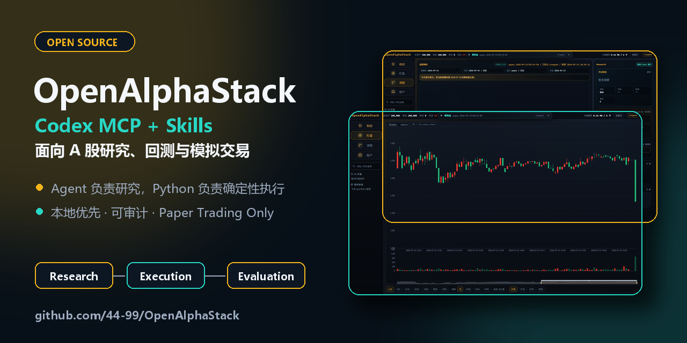
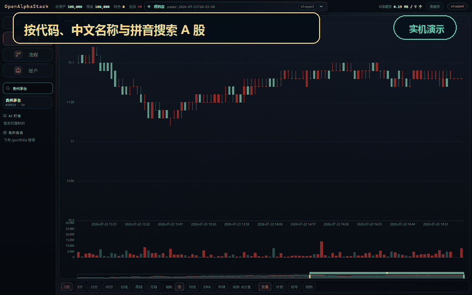

<div align="center">

<h1>OpenAlphaStack</h1>

<p>
  <a href="README.md">简体中文</a> ·
  <a href="README_EN.md">English</a>
</p>

<p><strong>An open-source Codex plugin stack for auditable A-share research, backtesting, and paper trading.</strong></p>

[](https://github.com/44-99/OpenAlphaStack/actions/workflows/ci.yml)
[](LICENSE)
[](pyproject.toml)
[](.codex-plugin/plugin.json)
[](.mcp.json)
[](https://github.com/44-99/OpenAlphaStack/stargazers)

[Website](https://44-99.github.io/OpenAlphaStack/en.html) · [Getting started](docs/getting-started.md) · [Architecture](docs/architecture.md) · [Skills](docs/skills.md) · [Roadmap](docs/roadmap.md)

</div>

<p align="center">
  <a href="https://44-99.github.io/OpenAlphaStack/en.html">
    
  </a>
</p>

OpenAlphaStack packages A-share domain Skills and a typed local MCP server as a
Codex plugin. Codex Desktop owns conversations, research and schedules. Python
owns deterministic validation, T+1 rules, fees, account state and paper
execution.

The canonical product interface and documentation are in Simplified Chinese.
This concise page exists for overseas Chinese users, developers researching
China's A-share market, and MCP/Codex tool builders evaluating the architecture.

> Research, backtesting and paper trading only. OpenAlphaStack does not place
> real orders or promise investment returns.

## See it in action

<p align="center">
  
</p>

The recording comes from the local paper-trading Dashboard. The public
[website](https://44-99.github.io/OpenAlphaStack/en.html) is static and never
exposes local account data, market-data services, or execution endpoints.

## What it provides

- Codex Skills for market analysis, screening, stock analysis and T0 research.
- Typed MCP tools for market data, risk calculations, backtests and paper plans.
- A deterministic Python paper engine with SQLite state and append-only audit
  projections.
- A local FastAPI + React Dashboard for A-share search, K-lines, plans,
  positions, ledger events and the Research → Execution → Evaluation workflow.
- A single-Agent default: Skills are composed on demand without mandatory
  sub-agent orchestration.

## Architecture

```text
Codex task / schedule
        │
Domain Skills ───────► typed local MCP
                            │
                 market / risk / backtest
                            │
                 deterministic paper engine
                            │
                  SQLite + audit projections
                            │
                      local Dashboard
```

## Quick start

Requirements: Python 3.10+, Node.js 20.19+, and Codex Desktop.

```powershell
git clone https://github.com/44-99/OpenAlphaStack.git
cd OpenAlphaStack
py -m venv .venv
.\.venv\Scripts\Activate.ps1
python -m pip install -e ".[all]"
npm ci
npm run dashboard:build
openalphastack doctor
codex plugin marketplace add .
codex plugin add open-alpha-stack@openalphastack-local
openalphastack app start
```

Restart Codex Desktop and start a new task in this repository before invoking a
packaged Skill. Open `http://127.0.0.1:8800/dashboard` for the local Dashboard.

For the full setup, safety contract, engine commands and verification workflow,
use the [Simplified Chinese getting-started guide](docs/getting-started.md) and
canonical [Simplified Chinese README](README.md).

Reusable screenshots, the demo GIF, and publication boundaries are documented
in the [media kit](docs/media-kit.md).

## License

MIT © OpenAlphaStack
